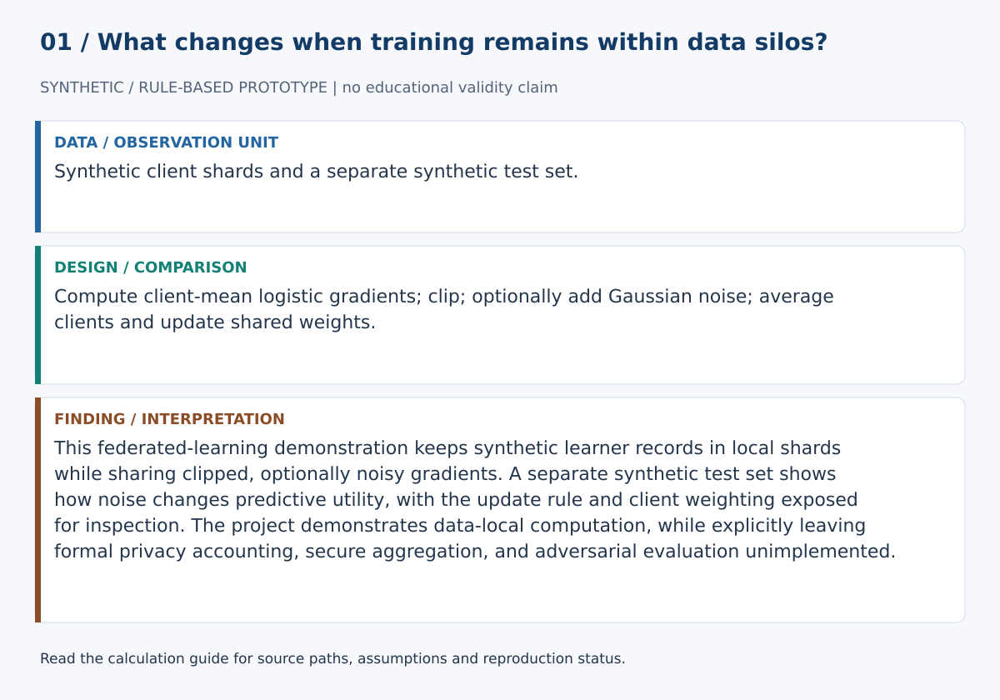
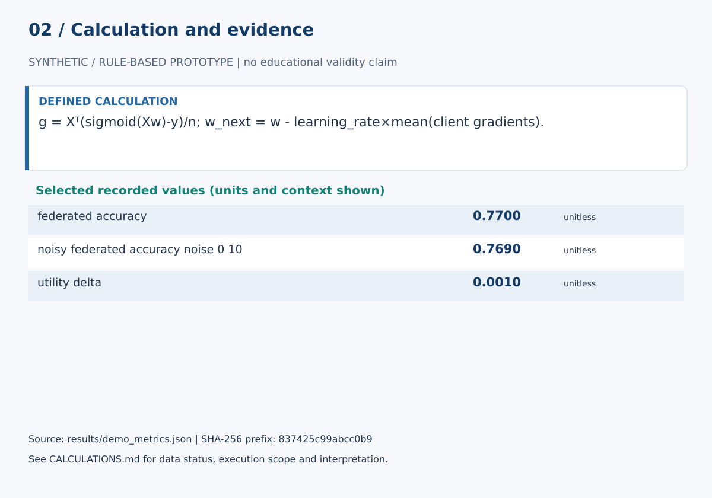

# Privacy-Preserving Learning Analytics

This federated-learning demonstration keeps synthetic learner records in local shards while sharing clipped, optionally noisy gradients. A separate synthetic test set shows how noise changes predictive utility, with the update rule and client weighting exposed for inspection. The project demonstrates data-local computation, while explicitly leaving formal privacy accounting, secure aggregation, and adversarial evaluation unimplemented.

## Start here

- [Calculations, evidence and verification scope](CALCULATIONS.md)
- [Figure sources and exact numerical paths](docs/figure_spec.json)
- [Data status](data/README.md)





**Review scope:** The existing suite requires unavailable dependencies; no full-suite pass is claimed. The bundled demonstration executed successfully in this review.

## Detailed project documentation

[](https://github.com/devissaputra/privacy_preserving_learning_analytics/actions/workflows/ci.yml)

**Category:** AI in Education  
**A reproducible federated-learning demonstration for studying data-local training and the utility effects of gradient clipping and Gaussian noise on synthetic learner data.**

> Research prototype. All bundled data and results are synthetic demonstrations. Nothing in this repository should be interpreted as evidence about real learners, teachers, institutions, or a formal privacy guarantee.


## Why this project exists

Learning analytics can be useful while still collecting too much. This repository explores one engineering pattern for reducing raw-data movement: learner records remain in synthetic client shards while model gradients are aggregated centrally.

The implementation can clip gradients and add Gaussian noise before aggregation. That is useful for studying utility sensitivity, but **it is not a formal differential-privacy implementation** because the repository does not include privacy accounting, ε/δ reporting, secure aggregation, or an explicit threat-model evaluation.

## Research questions

1. What utility does the federated baseline achieve when raw synthetic learner records remain local?
2. How does gradient clipping and added Gaussian noise change model accuracy on the same synthetic task?
3. What additional evidence would be required before making a formal privacy claim?

## What the repository does


The implemented pipeline follows five stages:

1. **Local learner silos**
2. **Local gradients**
3. **Federated aggregation**
4. **Gradient clipping + optional Gaussian noise**
5. **Utility evaluation**

The baseline is intentionally compact so clipping, aggregation, and utility changes can be audited before formal privacy accounting, secure aggregation, or attack-based privacy evaluation is added.

## Core outputs

- `federated_accuracy`
- `noisy_federated_accuracy_noise_0_10`
- `utility_delta`


The dashboard is generated from **synthetic data**. It reports software outputs for one seeded demonstration, not an empirical education result and not a privacy guarantee.

## Quick start

```bash
python -m venv .venv
source .venv/bin/activate  # Windows: .venv\Scripts\activate
pip install -e .[dev]
python examples/demo.py
pytest -q
```

You can also use Docker:

```bash
docker build -t privacy_preserving_learning_analytics .
docker run --rm privacy_preserving_learning_analytics
```

## Repository structure

```text
privacy_preserving_learning_analytics/
├── src/privacy_preserving_learning_analytics/  # core implementation and synthetic-data generator
├── examples/demo.py                            # end-to-end reproducible demo
├── tests/                                      # executable unit tests
├── docs/                                       # research design, data dictionary, references
│   └── images/                                 # auditable project diagrams
├── results/                                    # synthetic demo outputs only
├── config/default.yaml
├── Dockerfile
├── Makefile
└── pyproject.toml
```

## Research design in one picture


The fuller design rationale is in [`docs/research_design.md`](docs/research_design.md), including constructs, assumptions, validation steps, and a proposed empirical extension.

## Reproducibility choices

- Synthetic generation uses a fixed random seed.
- The core metrics are implemented as small, testable functions.
- The demo writes machine-readable results into `results/`.
- CI runs the tests on every push and pull request.
- No API keys, proprietary datasets, or external model calls are required for the baseline.

## Responsible-use boundaries

- Noise scale in this demo is **not** converted into a formal epsilon guarantee.
- Synthetic clients do not reproduce real institutional heterogeneity.
- Federated learning reduces raw-data movement but does not, by itself, guarantee privacy.
- Clipping plus Gaussian noise should not be described as differential privacy without a valid mechanism definition and accountant.

## Strong next experiments

- Integrate Opacus or TensorFlow Privacy with explicit ε/δ accounting.
- Add secure aggregation and a stated adversary/threat model.
- Add membership-inference or related attack-based evaluation.
- Benchmark non-IID client distributions and fairness across learner subgroups.

## References

See [`docs/references.md`](docs/references.md). The references locate the project in current AIED, learning-analytics, human-centered AI, and privacy research. They do **not** imply endorsement or affiliation.

## Citation

If you build on this research prototype, use the metadata in [`CITATION.cff`](CITATION.cff).

## License

MIT for the code in this repository. Research data from future studies should use a separate data-governance and consent process.
