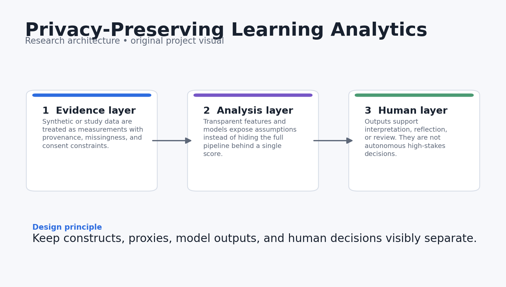
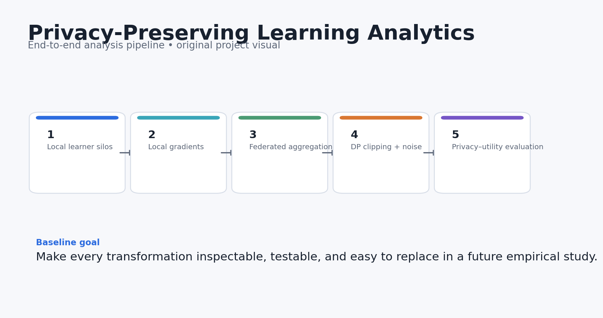
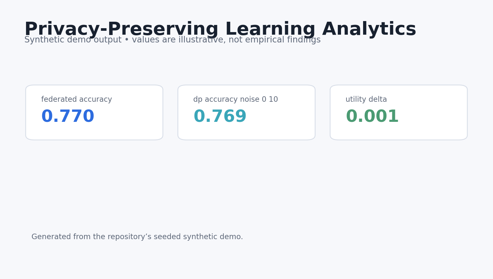
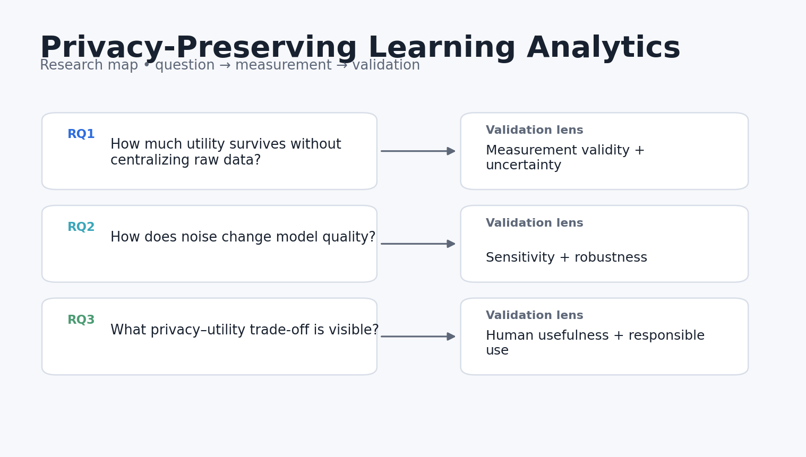

# Privacy-Preserving Learning Analytics

[](https://github.com/devissaputra/privacy_preserving_learning_analytics/actions/workflows/ci.yml)

**A reproducible privacy–utility benchmark using federated learning and differential privacy on synthetic learner data.**

> Research prototype. All bundled data and results are synthetic demonstrations. Nothing in this repository should be interpreted as evidence about real learners, teachers, or institutions.



## Why this project exists

Learning analytics can be useful while still collecting too much. This repo makes privacy an engineering variable rather than a footnote by comparing centralized, federated, and noisy training regimes on the same prediction task.

The engineering goal is simple: make the research logic inspectable. Every metric in the demo can be traced back to a small function, the demo data can be regenerated from a fixed seed, and the limitations are stated next to the claims rather than buried at the end.

## Research questions

1. How much utility is retained when raw learner records stay local?
2. How does clipping and noise change model quality?
3. What privacy–utility trade-offs should be reported before deployment?

## What the repository does



The reference pipeline follows five stages:

1. **Local learner silos**
2. **Local gradients**
3. **Federated aggregation**
4. **DP clipping + noise**
5. **Privacy–utility evaluation**

The current implementation is deliberately compact enough to audit. It is a foundation for a real study, not a theatrical “AI demo.”

## Core outputs

- `central_accuracy`
- `federated_accuracy`
- `dp_accuracy`
- `gradient_norm`
- `utility_delta`



The dashboard above is generated from **synthetic data** and is included only to show what the analysis surface looks like. It is not a reported empirical result.

## Quick start

```bash
python -m venv .venv
source .venv/bin/activate  # Windows: .venv\Scripts\activate
pip install -e .[dev]
python examples/demo.py
pytest -q
```

You can also use Docker:

```bash
docker build -t privacy_preserving_learning_analytics .
docker run --rm privacy_preserving_learning_analytics
```

## Repository structure

```text
privacy_preserving_learning_analytics/
├── src/privacy_preserving_learning_analytics/        # core implementation and synthetic-data generator
├── examples/demo.py        # end-to-end reproducible demo
├── tests/                  # executable unit tests
├── docs/                   # research design, data dictionary, references
│   └── images/             # original project diagrams and demo visualisations
├── results/                # synthetic demo outputs only
├── config/default.yaml
├── Dockerfile
├── Makefile
└── pyproject.toml
```

## Research design in one picture



The fuller design rationale is in [`docs/research_design.md`](docs/research_design.md), including constructs, assumptions, validation steps, and a proposed empirical extension.

## Reproducibility choices

- Synthetic generation uses a fixed random seed.
- The core metrics are implemented as small, testable functions.
- The demo writes machine-readable results into `results/`.
- CI runs the tests on every push and pull request.
- No API keys, proprietary datasets, or external model calls are required for the baseline.

## Responsible-use boundaries

- Noise scale in this demo is not converted into a formal epsilon guarantee.
- Synthetic clients do not reproduce real institutional heterogeneity.
- Federated learning reduces data movement but does not, by itself, guarantee privacy.

## Strong next experiments

- Integrate Opacus or TensorFlow Privacy for formal accounting.
- Add secure aggregation and membership-inference attacks.
- Benchmark non-IID client distributions and fairness across learner subgroups.

## References

See [`docs/references.md`](docs/references.md). The references are there to locate the project in current AIED, learning-analytics, human-centered AI, and instructional-design research. They do **not** imply endorsement or affiliation.

## Citation

If you build on this research prototype, use the metadata in [`CITATION.cff`](CITATION.cff).

## License

MIT for the code in this repository. Research data from future studies should use a separate data-governance and consent process.
